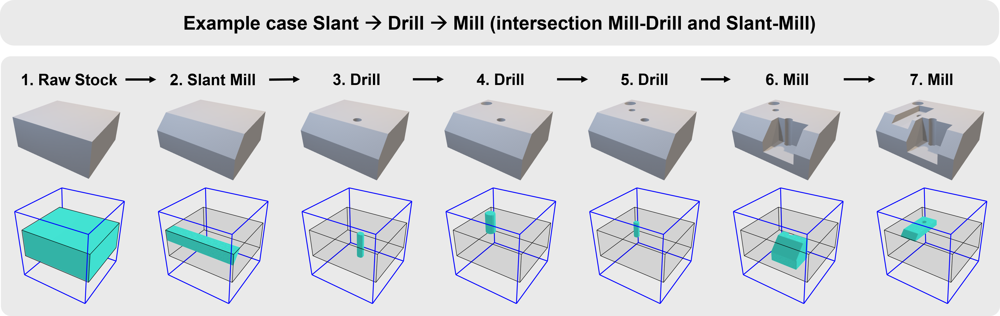

# DeepMS-DataGen: Synthetic Dataset Generator for Machining Process Sequencing

This project features a Python-based FreeCAD macro designed to generate synthetic datasets of 3D manufacturing parts and their operation sequences. This dataset generator was developed to support the research presented in the paper ["A data-driven approach to machining process sequencing using transformers"](https://doi.org/10.1016/j.jmsy.2025.07.022). The tool automates the creation of voxelized representations of parts while tracking material removal at each machining step to support the training of the DeepMS framework described in the paper.

The generated dataset includes:

- **STL files** representing part geometries after each operation
- **HDF5 files** containing 3D voxel grids with delta volumes and operation labels

These datasets can be utilized for training machine learning models in manufacturing process automation. The generated samples adhere to random machining sequencing rules derived from a predefined set of literature-based guidelines. These rules focus on feature intersections, such as drilling, slant-face, and milling features, as well as volume removal.

Below is an example of a generated data sample, illustrating the voxelized representation of a 3D manufacturing part. This sample includes intersecting drill, mill, and slant-face features. The sequence of operations is generated according to the predefined rules that govern these intersections. In cases where no intersecting rules apply, the operation order is determined by the volume of material removed.



## Project Structure
```
/DeepMS-DataGen/
│
├── generate_data.FCMacro         # Main FreeCAD macro for dataset generation
├── generate_sample.FCMacro       # Example FreeCAD macro file for generating sample data
│
├── /bin/                         # Directory for binvox executable (not included, download separately)
│   └── README.md                 # Instructions for obtaining and installing binvox
│
├── [User-specified directory]    # Output location specified in the macro
│   ├── /seq_stl/                 # Folder for STL files (part shapes after each operation)
│   └── /seq_h5/                  # Folder for HDF5 voxel data with delta volumes
│
├── /scripts/                     # Python scripts for dataset generation and utilities
│   ├── voxels.py                 # VoxelConverter class for voxel operations
│   ├── parts.py                  # PartGenerator class for generating CAD parts
│   ├── macro.py                  # Additional macro-related functionality
│   ├── utils.py                  # Utility functions for dataset processing
│   └── __init__.py               # Makes the scripts directory a package
│
├── /notebooks/                   # Jupyter notebooks for data visualization and experiments
│   └── data_viewer.ipynb         # Notebook for visualizing voxel data
|
├── split_data.py                # Script for splitting generated datasets
├── split_data_voxels.py        # Script for splitting voxelized datasets
├── requirements.txt            # Required Python packages for FreeCAD environment
│
└── README.md                   # Project documentation
```

## Getting Started

### Requirements

To run the `generate_data.FCMacro`, you need:
- **FreeCAD** installed with Python support.
- **Binvox** for voxelization. Download the binvox executable from the [official website](http://www.patrickmin.com/binvox/) and place it in the `/bin/` folder; ensure it is added to your system's PATH. See the README file in the `/bin/` directory for detailed instructions.
- The packages listed in `requirements.txt` must be installed in the Python environment of the FreeCAD installation.

### Running the Macro

1. Open FreeCAD and load the `generate_data.FCMacro`.
2. **Important:** Update the output directory paths in the macro file to specify where you want the generated data to be stored:
   ```python
   base_h5_dir = 'C:/path/to/your/directory/seq_h5'
   base_stl_dir = 'C:/path/to/your/directory/seq_stl'
   csv_file_path = 'C:/path/to/your/directory/dataset_info.csv'
   ```
3. Modify the sample size if necessary; it is set to generate **1.08 million samples** by default.
4. Run the macro within FreeCAD's macro editor to start dataset generation. The generated datasets will be stored in your specified directories, organized into `stl/` for part shapes and `h5/` for voxel data. A CSV file will also be created with metadata about each generated sample (including feature combinations and counts).

### Folder Descriptions

- **/bin/**: Directory where the binvox executable should be placed (download separately from http://www.patrickmin.com/binvox/).
- **Output Data Folders**: The generated datasets will be created in the directories specified in the macro file:
  - **seq_stl/**: Stores STL files of part geometries after each operation.
  - **seq_h5/**: Contains HDF5 files with voxel data and delta volumes.
- **/scripts/**: Python scripts utilized for dataset generation and related utilities.
- **/notebooks/**: Jupyter notebooks for data visualization and experimentation.

## Note

The dataset is not included in this repository; it will be generated when you run the macro in your specified output directories. Due to the large volume of data (potentially over 1.08 million samples), ensure you have sufficient disk space available in your chosen location.

## Contributing

Contributions to enhance the functionality or expand the dataset generation process are welcome. Please feel free to open an issue or submit a pull request.

## License

This project is licensed under the MIT License - see the [LICENSE](LICENSE) file for details.

